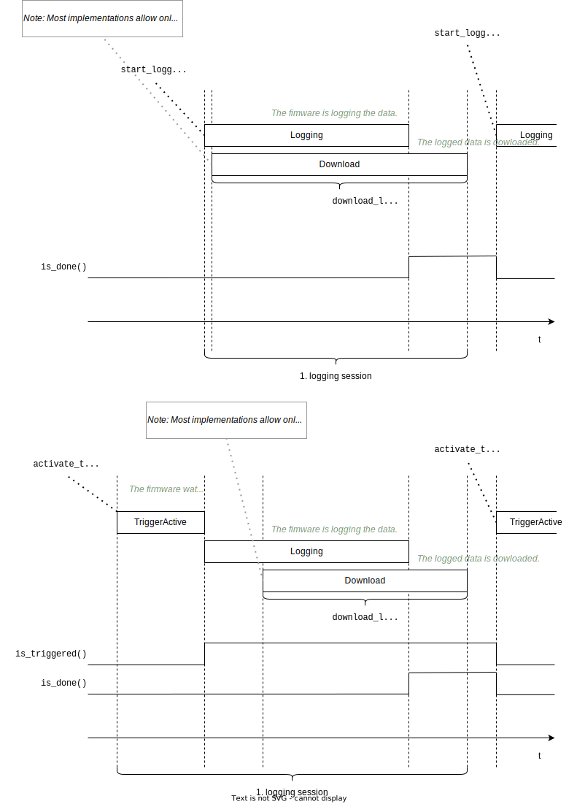

# Datalogger

## General Information

Some Trinamic products have a logging mechanism implemented into firmware, also called RAMDebug at some places.
This logging mechanism allows sampling of signals at a high rate, that would otherwise not possible to achieve via the communication interface.

Also the TMC-EvalSystem supports the logging mechanism, allowing Eval-chip data to be logged.

The following diagram gives an overview on the Datalogger concept. 


## Usage

### Basic example

This example keeps all optional settings at default.
It uses unconditional triggering, thus data will be logged immediately after `start_logging()` got called.

```py
    dl = tmc9660_eval.datalogger

    dl.config.samples_per_channel = 10
    dl.config.log_data = [
       TMC9660.MCC.ADC_I1_I0_SCALED.I0,
    ]

    dl.start_logging()

    dl.wait_till_done()

    dl.download_logs()

    print(dl.logs["ADC_I1_I0_SCALED.I0"])
```

Step by step details:

* We create reference to the Datalogger object as short alias.
  ```py
    dl = tmc9660_eval.datalogger
  ```
* The number of samples to be logged is given.
  ```py
    dl.config.samples_per_channel = 10
  ```
* The data to be logged is listed.
  ```py
    dl.config.log_data = [
       TMC9660.MCC.ADC_I1_I0_SCALED.I0,
    ]
  ```
* With the minimal configuration done we can start the logging.
  ```py
    dl.start_logging()
  ```
* The firmware now does the logging and we need to wait till it finished.
  ```py
    dl.wait_till_done()
  ```
* With the logging done, we can download the logs.
  ```py
    dl.download_logs()
  ```
* Finally we can access the logged data via the `logs` dictionary.
  ```py
    print(dl.logs["ADC_I1_I0_SCALED.I0"])
  ```
  The `dl.logs["ADC_I1_I0_SCALED.I0"]` returns a `DataLogger.Log` object and the print will look similar to this output:
  ```
    DataLogger.Log(rate_hz=25000.0, samples=[-9, -49, -65, -57, -81, -105, -25, -73, -105, -9])
  ```

## Change of the Sample/Logging Rate

The sample rate can be decrease using the `config.down_sampling_factor`:

```py
    dl.config.samples_per_channel = 10
    dl.config.down_sampling_factor = 2  # <--
    dl.config.log_data = [
       TMC9660.MCC.ADC_I1_I0_SCALED.I0,
       ...
```

This will be reflected in the printed log:

```
DataLogger.Log(rate_hz=12500.0, samples=[-5, -21, -5, -5, -53, -13, 19, -21, 11, -45])
```

## TODO - Continue with more details!

...