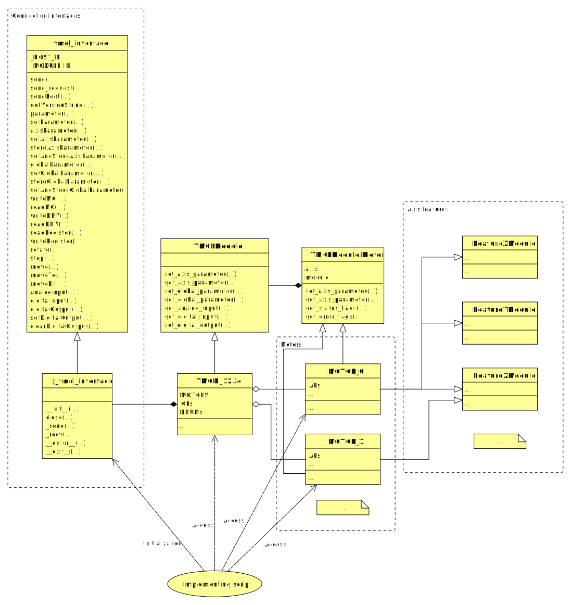

# Modules

## Structure

The following image shows a generalized UML diagram of a TMCL module.



The implementing script is intended to use either the motor objects of the
given module or the module object itself, after initialization of the connection interface.
Both access types have the same capability. However, when accessing the module
object, the axis number has to be specified for each axis-dependent command.
Supported commands for the modules are directly accessible from the module object.  
When using the motor object, supported commands, parameters and axis identifier are directly accessible
from the object itself, not requiring additional handling.

The motor objects within modules are accessible via the `MOTORS` list.
Each motor(-type) within modules are implemented in their own class, i.e.
`MOTOR_0`, `MOTOR_1`. Each one of these classes might have its very own
composition of features. Individual features for module motors are implemented
in the corresponding feature class, and inherited by the motor class in the module.
This way, the feature functions are directly accessible from the motor object.

Every module inherits from the general `TMCLModule` class, implementing
general module functions, which are supported by all modules, such as
`set_axis_parameter(...)`, `set_global_parameter(...)`, `set_digital_output(...)` etc.

Every module motor inherits from the general `TMCLModule.Motor` class, storing
general data such as axis number and module reference.  
Also, general axis-dependend functions for modules are reimplemented here,
without the requirement of axis argument, such as `set_axis_parameter(...)` and
`get_status_flags(...)`.

Modules need a connection interface upon construction. This library implements
many connection interfaces for standard computers, such as `usb_tmcl_interface`,
`kvaser_CANopen_interface`.  
Every TMCL-compatible connection interface inherits the `tmcl_interface` class.
This implements some basic TMCL commands accessible as functions.
Every TMCL command can additionally be issued using the `send(...)` and `send_request(...)` functions.
`send(...)` builds and sends a TMCL command based on the given arguments,
*waits for the reply and returns it*. `send_request(...)` just sends a TMCL command
*without waiting for a reply*.  
Specific interface implementations basically just need to implement the
`_send(...)` and `_recv(...)` functions to send and receive bytes via the interface.
If `with`-statement compatibility is desired, `__enter__(...)` and `__exit__(...)`
functions can be implemented aswell.

## Usage

### Module-level usage

The following code snipped shows the principle of using the module object to
work with TMCL-Modules on module-level.  
Change `TMCM_1270` and `usb_tmcl_interface` to your preferences. `X` is just a placeholder axis parameter.

```Python
from pytrinamic.modules.TMCM1270 import TMCM_1270
from pytrinamic.connections.UsbTmclInterface import UsbTmclInterface

con = UsbTmclInterface()
module = TMCM_1270(con, module_id=1)
axis = 0

module.set_axis_parameter(module.MOTORS[axis].AP.X, axis, 42)
module.rotate(axis, 1000)
module.stop(axis)

con.close()
```

After importing the required Python modules, the connection needs to be
initialized first. This is highly interface-specific, some interfaces might
need additional arguments, such as `port`, `datarate` etc.

With an interface initialized, the module object can be constructed.
There, also the `module_id` can be specified, in order to use multiple modules
on a shared bus. This needs to be configured with the module first. Consult the
TMCL firmware manual of the module for more details.

Having the module object, all general and specific module functions can be used
directly from the object, i.e. `set_axis_parameter(...)` and `rotate(...)`.
The axis parameter definitions are motor-specific and thus defined within the
motor object for the given axis.

### Motor-level usage

The following code snipped shows the principle of using the motor object to
work with TMCL-Modules on motor-level.  
`TMCM_1234` and `x_tmcl_interface` are fictional and for reference only,
to show the working principle.

```Python
from pytrinamic.modules.TMCM1270 import TMCM_1270
from pytrinamic.connections.UsbTmclInterface import UsbTmclInterface

con = UsbTmclInterface()
module = TMCM_1270(con, module_id=1)
motor = module.MOTORS[0]

# Feature parameters
motor.set_axis_parameter(motor.AP.X, 42)
motor.FeatureX.set_x(42)
motor.FeatureX.x = 42

motor.rotate(1000)
motor.stop()

con.close()
```

After importing the required Python modules, the connection needs to be
initialized first. This is highly interface-specific, some interfaces might
need additional arguments, such as `port`, `datarate` etc.

With an interface initialized, the module object can be constructed.
There, also the `module_id` can be specified, in order to use multiple modules
on a shared bus. This needs to be configured with the module first. Consult the
TMCL firmware manual of the module for more details.

To abstract away from the specific module, the motor objects for the desired axes
can be accessed via the `MOTORS` list and its members can be used directly. In the general case,
motors of multiple modules can be collected in lists in the implementation script. In the above example,
just one axis is used. All the general motor and feature functions are available
from the motor object without handling axis numbers.  
The features of a motor can be listed with `list_features(...)` function.  
The features of a motor are grouped into feature blocks, with its functions accessible
by `motor.FeatureX.function(...)`, `featureX` being an example feature and `function`
the feature-specific function to be called.  
Parameters for features are additionally accessible by either the corresponding
setter/getter functions or its *property*. Properties behave like variables
in script level, but accessing them invokes the corresponding setter/getter
function implicitly. In both cases, it comes down to axis parameters being
set/get in the module. This way, the *feature parameters* statements in the above
example are completely equivalent.
